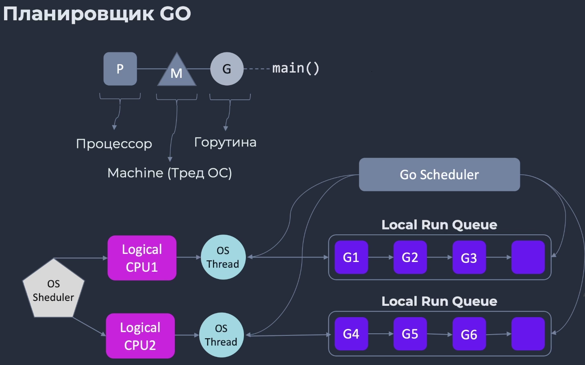

### Многопоточность

---

#### Термины и определения

* Процесс - ?
* Поток (тред) - ?
* Горутина - ?
* Планировщик занимает в каждом ядре процессора по одному потоку, в которых запускает горутины.

#### Процессы и потоки

* Процесс означает запуск программы, поток - запуск части процесса.
* У процесса может быть несколько потоков.
* Программа при старте запускается в новом процессе, а поток работает внутри процесса.
* Память процессов изолирована. Потоки в одном процессе разделяют память между собой.
* Потоки более легковесные, чем процессы.
* Потоки завершаются быстреее, чем процесс.
* Переключение контекста на процессе существенно дороже.

#### Планировщик

* Необходимо управлять потоками ОС из программы.
* Потоки и переключения между ними - сложно и дорого.
* Горутина весит 2 кб, а тред 2 мб.
* Треды большие и сложные, а горутины простые.
